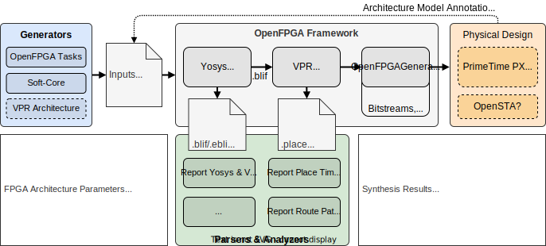

# OpenFPGA Soft-cores Exploration Platform

[](https://openfpga-softcores.readthedocs.io/en/latest/?badge=latest)


The goal of the project is to co-architect open-source processors (or soft-cores) and heterogeneous FPGA targets using the open-source [OpenFPGA](https://github.com/lnis-uofu/OpenFPGA) framework.
As presented in the figure below, the proposed platform acats as a Python API, wrapping EDA tools, for fast and accurate design space evaluation.

The main objectives are to provide:

1. A methodology to improve soft-core mapping on FPGA targets.
2. Packer, placer and router analysis, to identify path bottlenecks related to the soft-core RTL description.
3. Better domain-specific FPGA architectures tuned according to the design and application requirements.

<p align="center">
    
</p>

## Getting Started

### Installation

These following commands will checkout the latest version of the platform and its submodules and install [OpenFPGA](https://github.com/lnis-uofu/OpenFPGA) framework. 
Please find other installation options, in the project documentation.

```bash
git clone --recursive https://github.com/lnis-uofu/OpenFPGA.git
cd OpenFPGA-Softcores
third_party/install_openfpga.sh  # to install OpenFPGA locally
```

### Source the project environment

This project inherits from the *OpenFPGA* environment tools and configuration files.
Before using the platform, always source the `setup_env.sh` to use *OpenFPGA* flows and verified FPGA architectures, with the following command:

```bash
source setup_env.sh
```

### Dependencies

Currently the project required at least Python `3.6`, such as the *OpenFPGA* framework.
However, additional Python packages must be installed with the following commands.
If you are in a restricted environment without admin rights, you can still installed a virtual Python environment as described in the project documentation.

```bash
pip install -r requirements.txt                 # to support OpenFPGA-Softcores scripts
pip install -r $OPENFPGA_PATH/requirements.txt  # to support OpenFPGA scripts
pip install -r docs/requirements.txt            # only for developers
```

### Directory structure

- **docs/** -- Documentation of the *OpenFPGA-Softcores* project.
- **examples/** -- DSE scripts to evaluate FPGA archs, soft-core params and EDA tool performances.
- **fpga_archs/** -- Task files of the FPGA architectures, define default *OpenFPGA* simulation parameters.
- **openfpga_flow/** -- Additional *OpenFPGA* configuration files, used for large design space exploration.
- **platform/** -- Python library package of launchers, reporters and generators.
- **tests/** -- Configuration files to run multiple simulations with a sweep of parameters.
- **third_party** -- Dependency install directory for soft-core projects and *OpenFPGA* framework.

Automatically generated directories:

- **outputs/** -- Results and reports generated by the *OpenFPGA-Softcores* platform.
- **run_dir/** -- Results and reports generated by the *OpenFPGA* framework.
- **pyvenv/** -- [optional] Local virtual Python environment used for standalone installation.

## Tools

### A. Launchers and loop optimizers

#### A.1 `run-softcore`

This tool runs a single soft-core benchmark simulation with the platform using a given FPGA architecture.
Read the documentation for detailed optional arguments of the basic command:

```bash
run-softcore <soft-core> <fpga-architecture>
```

### B. Report and result extractions 

#### B.1 `report-yosys-vpr`

This tool parses *Yosys* and *VPR* result files generated by the *OpenFPGA* framework, and generate a CSV file.
Read the documentation for detailed optional arguments of the basic command:

```bash
report-yosys-vpr run_dir/run001 -o <output-csv-filename>
```

#### B.2. `report-place-timing`

This tool parses the timing report (setup, hold or pre-pack) generated by *OpenFPGA* framework and extend the description for each point of the path (*block type*, *block ID*, *block coordinates*, ...) using `.net` and `.place` reports.
The generated output file is a report file, following the report timing file standards.
Read the documentation for detailed optional arguments of the basic command:

```bash
report-place-timing run_dir/run001 -o <output-rpt-filename>
```

#### B.3. `report-route-paths`

This tool parses the timing report (setup, hold or pre-pack) generated by *OpenFPGA* framework and extend the description for every start and end points of the path, adding basic metrics for a more complete analysis, RTL to physical routing.
The generated output file is a CSV file having a single line per path.
Read the documentation for detailed optional arguments of the basic command:

```bash
report-route-paths run_dir/run001 -o <output-csv-filename>
```

### C. Analysis and figure generators

#### C.1. `analyze-yosys-vpr`

This tool provides a quick data analysis coming from the *Yosys* and *VPR* generated files.

```bash
analyze-yosys-vpr <yosys-vpr-result-file>
```

#### C.2. `analyze-placing`

This tool provides a post-route path analysis by grouping every paths by *Physiscal Block* (PB) types (*ff*, *bram*, *io*) or by bus names related to the RTL description of the soft-core.

```bash
analyze-placing <search-path> <param-file>
```

## Available Soft-cores

FPGA architectural parameters include BRAM (DFF, OpenRAM) and DSP (Multiplier/Divider) sizing for low- and mid-range 32-bit RISC-V processors, as presented in the table below.

<div align="center">

| **Name**                                             | **ISA**   | **Language**  | **Stages** | **Interface** | **App Range**   |
|------------------------------------------------------|-----------|---------------|------------|---------------|-----------------|
| [VexRiscv](https://github.com/SpinalHDL/VexRiscv)    | I,M,A     | Scala/Verilog | 2-5        | WB, AXI       | Low/Mid         |
| [PicoRV32](https://github.com/YosysHQ/picorv32)      | I,M,C     | Verilog       | 3          | WB, AXI       | Low (High-Perf) |
| [Ibex](https://github.com/lowRISC/ibex)              | I,M,C,E,B | SystemVerilog | 2          | -             | Low             |
| [RISCY](https://github.com/pulp-platform/pulpissimo) | I,M,C,F   | SystemVerilog | 4          | -             | Mid             |
| [Taiga](https://gitlab.com/sfu-rcl/Taiga)            | I,M,A     | SystemVerilog | 3          | WB            | Low             |
| [SERV](https://github.com/olofk/serv)                | I,M       | Verilog       | 33         | -             | Low (Low-Area)  |

</div>

