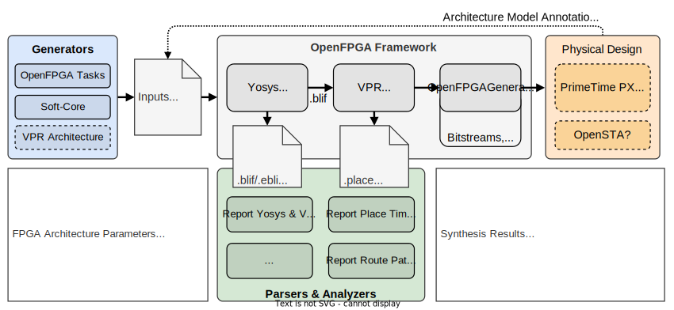

# OpenFPGA Soft-cores Exploration Platform

The goal of the project is to co-architect open-source processors (or soft-cores) and heterogeneous FPGA targets using the open-source [OpenFPGA](https://github.com/lnis-uofu/OpenFPGA) framework.
As presented in the figure below, the proposed platform acts as a Python API, wrapping EDA tools, for fast and accurate design space evaluation.
The main objectives are to provide: (1) a methodology to improve soft-core mapping and debugging, (2) a packer, placer and router analysis, to identify path bottlenecks related to the soft-core RTL description, and (3) better domain-specific FPGA architectures tuned according to the design and application requirements.



## Getting Started

### 1. Install and build the latest OpenFPGA framework version:
```bash
git clone https://github.com/lnis-uofu/OpenFPGA.git
cd OpenFPGA
make all
```

### 2. Source the OpenFPGA environment, before running soft-core simulations:
```bash
source openfpga.sh
```

The OpenFPGA environment need to be sourced first, in order to use OpenFPGA flows and verified FPGA architectures.

### 3. Checkout the current repository, and download submodules:
```bash
git clone --recursive https://github.com/lnis-uofu/OpenFPGA-Softcores.git
cd OpenFPGA-Softcores
```

### 4. Source the project environment:
```bash
source setup_env.sh
```

## Tools

### 1. Run soft-core simulations (`run-softcore`)

Use OpenFPGA framework for a given soft-core benchmark and a given FPGA architecture (using a task file), using the following command:
```bash
run-softcore picorv32 fpga_archs/k6_frac_N10_adder_chain_40nm.conf \
    --device-layout 40x40 --channel-width 150 --cache-size 2048
```

Optional arguments:
- `--device-layout <WxH|auto>`: define a fixed FPGA layout dimensions (default: auto)
- `--channel-width <int|auto>`: define a fixed FPGA channel width (default: auto)
- `--cache-size <int>`: define the memory size (L1) of the core in bytes (default: 1024)
- `--isa {i,im,imc}`: enable RISC-V ISA extensions (default: i)
  - `i`: base integer instruction set
  - `m`: enable the multiplier/divider instruction extension
  - `c`: enable the compressed instruction extension
- `--run-list <csv-file>`: run multiple simulations listed in a CSV file, giving all arguments by columns
- `--run-dir <path>`: save all OpenFPGA outputs in a given directory (default: run_dir)

### 2. Report OpenFPGA results (`report-yosys-vpr`)

Parse Yosys and VPR result files generated by the OpenFPGA framework, usually located in the `run_dir` directory, in order to generate a CSV report file, using the following command:
```bash
report-yosys-vpr run_dir/run* -o k6_n10_report.csv
```

Optional arguments:
- `-o <csv-file>`: save results in CSV format (default: report_parser.csv)

### 3. Report timings and physical block placement of all paths (`report-place-timing`)

Parse the timing report (setup, hold or pre-pack) generated by OpenFPGA framework and extend the description for each point of the path (PB type, block ID, coordinates, ...) using *.net and *.place reports.
The generated output file follows the standard timing report format, using the following command:
```bash
report-place-timing run_dir/run001 -o outputs/report_place_timing.setup.rpt
```

Optional arguments:
- `-p <path-id>, --path-id <path-id>`: define a given path number to print (default: 0)
- `--hold`: parse the hold timing report (default: False)
- `--pre-pack`: parse the pre-pack timing report (default: False)
- `-o <rpt-file>`: analyze all paths in the report file and save them

### 4. Report paths with exteneded RTL to PB descriptions (`report-route-paths`)

Parse the timing report (setup, hold or pre-pack) generated by OpenFPGA framework and extend the description for every start and end points of the path, adding basic metrics for a more complete analysis.
The generated output file is a CSV file having one line per path, using the following command:
```bash
report-route-paths run_dir/run001 -o outputs/report_paths.setup.csv
```

Optional arguments:
- `-p <path-id>, --path-id <path-id>`: define a given path number to print (default: 0)
- `--hold`: parse the hold timing report (default: False)
- `--pre-pack`: parse the pre-pack timing report (default: False)
- `-o <csv-file>`: save all paths a given CSV file (default: None)

## Available Softcores

FPGA architectural parameters include BRAM (DFF, OpenRAM) and DSP (Multiplier/Divider) sizing for low- and mid-range 32-bit RISC-V processors, as presented in the table below.

<div align="center">

| **Name**                                             | **ISA**   | **Language**  | **Stages** | **Interface** | **App Range**   |
|------------------------------------------------------|-----------|---------------|------------|---------------|-----------------|
| [VexRiscv](https://github.com/SpinalHDL/VexRiscv)    | I,M,A     | Scala/Verilog | 2-5        | WB, AXI       | Low/Mid         |
| [PicoRV32](https://github.com/YosysHQ/picorv32)      | I,M,C     | Verilog       | 3          | WB, AXI       | Low (High-Perf) |
| [SERV](https://github.com/olofk/serv)                | I,M       | Verilog       | 33         | -             | Low (Low-Area)  |
| [Taiga](https://gitlab.com/sfu-rcl/Taiga)            | I,M,A     | SystemVerilog | 3          | WB            | Low             |
| [Ibex](https://github.com/lowRISC/ibex)              | I,M,C,E,B | SystemVerilog | 2          | -             | Low             |
| [RISCY](https://github.com/pulp-platform/pulpissimo) | I,M,C,F   | SystemVerilog | 4          | -             | Mid             |

</div>

## Dependencies

- OpenFPGA framework (v1.1.0)
- Python 3.9 (packages: numpy)
