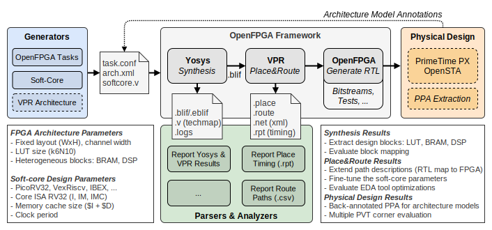

Welcome to OpenFPGA-Softcores' documentation!
=============================================

The goal of the project is to co-architect open-source processors (or soft-cores) and heterogeneous FPGA targets using the open-source `OpenFPGA <https://github.com/lnis-uofu/OpenFPGA>`_ framework.
The proposed platform acts as a Python API, wrapping EDA tools, for fast and accurate design space exploration.

The main objectives are to provide:

#. A methodology to improve soft-core mapping on FPGA targets.
#. Packer, placer and router analysis, to identify path bottlenecks related to the soft-core RTL description.
#. Better domain-specific FPGA architectures tuned according to the design and application requirements.

   *OpenFPGA-Softcores* platform overview.

.. note::
   This project is under active development.

.. toctree::
   :maxdepth: 2
   :caption: User Guide
   :numbered: 2
   
   quickstart
   tools
   analysis

.. toctree::
   :maxdepth: 2
   :caption: Reference Manual
   :numbered: 2

   parsers_api
   softcores_api
   generators_api

Indices and tables
------------------

* :ref:`genindex`
* :ref:`modindex`
* :ref:`search`
