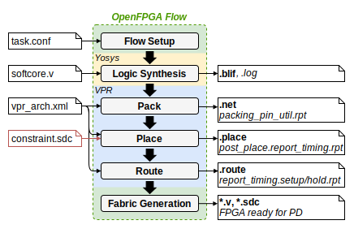

Parsers API
===========

This section describes the `Parsers API` providing public classes and methods to parse OpenFPGA, Yosys and VPR generated output files, as presented in :numref:`fig_flow_files`.

   
   Output generated files by the *OpenFPGA* framework, parsed by the *OpenFPGA-Softcores* platform.

Yosys Parsers
-------------

blif_parser
^^^^^^^^^^^

.. automodule:: parsers.blif_parser
    :members:

yosys_log_parser
^^^^^^^^^^^^^^^^

.. automodule:: parsers.yosys_log_parser
    :members:

VPR Parsers
-----------
 
vpr_net_parser
^^^^^^^^^^^^^^
 
.. automodule:: parsers.vpr_net_parser
    :members:

vpr_place_parser
^^^^^^^^^^^^^^^^^
 
.. automodule:: parsers.vpr_place_parser
    :members:

vpr_route_parser
^^^^^^^^^^^^^^^^
 
.. automodule:: parsers.vpr_route_parser
    :members:

vpr_report_timing_parser
^^^^^^^^^^^^^^^^^^^^^^^^
 
.. automodule:: parsers.vpr_report_timing_parser
    :members:

vpr_log_parser
^^^^^^^^^^^^^^
 
.. automodule:: parsers.vpr_log_parser
    :members:

