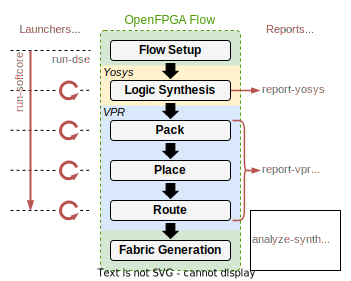

Tools
=====

This section describes the tools use to run, report and analyze OpenFPGA, Yosys and VPR results, as presented in :numref:`fig_flow_dse`.
These enable an easier 

   Todo

run-softcore
------------
.. program:: run-softcore

Basic Usage
~~~~~~~~~~~

Use OpenFPGA framework for a given soft-core benchmark and a given FPGA architecture (using a task file), using the following command::

    run-softcore <soft-core> <architecture>

where:

.. option:: <soft-core>

    Soft-core processor to evaluate.

.. option:: <architecture>

    FPGA architecture to evaluate, using any files in the 'fpga_archs/' dir.

.. note::

    This script use directly the OpenFPGA framework, then the ``OPENFPGA_PATH`` environment variable need to be exported.
    Just source the project ``setup_env.sh`` script to fix that error.

Optional Arguments
~~~~~~~~~~~~~~~~~~

.. option:: --device-layout <WxH|auto>

    Define a fixed FPGA layout.

    **Default:** ``auto``

.. option:: --channel-width <int|auto>

    Define a fixed FPGA channel width.

    **Default:** ``auto``

.. option:: --cache-size <int>

    Define the memory size of the soft-core (in Bytes).

    **Default:** ``1024``

.. option:: --isa {i,im,ima}

    Enable RISC-V ISA extensions.

    - ``i``: base integer instruction set,
    - ``m``: enable the multiplier/divider instruction extension,
    - ``c``: enable the compressed instruction extension.

    **Default:** ``i``

.. option:: --run-list <csv-filename>

    run multiple simulations listed in a CSV file, giving all arguments by columns

    **Default:** `None`

.. option:: --run-dir <path>
    
    Save all OpenFPGA outputs in a given directory
    
    **Default:** ``run_dir/``

